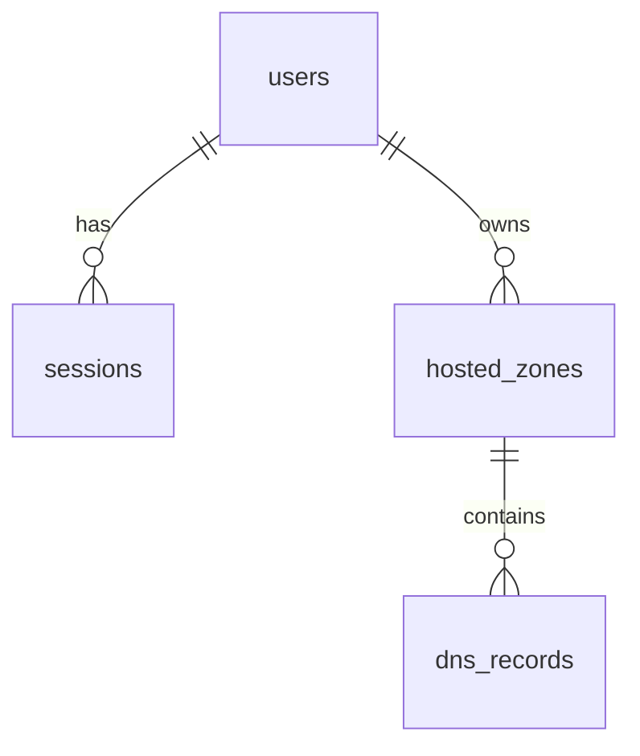

# AWS Route 53 Clone

A Route 53 console-inspired CRUD application for DNS configuration data. It models DNS configuration data only: it does not resolve DNS, delegate nameservers, or call AWS.

## Setup Instructions

Prerequisites: Python 3.11+, Node.js 20+, and MySQL support.

1. **Environment Setup**
   ```powershell
   Copy-Item backend/.env.example backend/.env
   Copy-Item frontend/.env.example frontend/.env.local
   ```

2. **Backend Setup**
   ```powershell
   Set-Location backend
   pip install -r requirements.txt
   python -m app.seed
   uvicorn app.main:app --reload --port 8000
   ```

3. **Frontend Setup**
   In another terminal:
   ```powershell
   Set-Location frontend
   npm install
   npm run dev
   ```

4. **Access the Application**
   Open `http://localhost:3000` and sign in with `demo` / `demo1234`.

**Docker Compose** is also supported:
```powershell
docker compose up --build
```
The `route53_data` named volume stores the SQLite database at `/data/app.db`.

---

## Architecture Overview

```text
Next.js 14 App Router -> FastAPI -> SQLAlchemy -> SQLite
                              |
                              +-- opaque HttpOnly session cookie
```

The application follows a standard separated frontend and backend architecture:
- **Frontend**: Next.js 14 UI, route shell, forms, notifications, and Playwright tests. Uses native fetch and a shared notification context.
- **Backend**: FastAPI API, SQLAlchemy models, Alembic migration, and seed scripts. Owns all normalization, authorization, record validation, and destructive-operation rules.

The browser middleware only checks cookie presence to avoid a protected-page flash. FastAPI validates the opaque token and ownership on every protected request. Tokens are cryptographically random; only their SHA-256 hashes are stored in the database.

---

## Database Schema

Users own sessions and hosted zones. Hosted zones own DNS records. New zones receive protected NS and SOA records. Record counts are computed at read time.

### Entity Relationship Diagram



### Tables

**users**
| Column | Type | Notes |
|---|---|---|
| id | integer | Primary key |
| username | string | Unique |
| password_hash | string | bcrypt hash |
| created_at | datetime | Creation timestamp |

**sessions**
| Column | Type | Notes |
|---|---|---|
| id | integer | Primary key |
| user_id | integer | Foreign key to users.id |
| token_hash | string | Unique SHA-256 hash; raw token is cookie-only |
| created_at | datetime | Creation timestamp |
| expires_at | datetime | Session expiry |

**hosted_zones**
| Column | Type | Notes |
|---|---|---|
| id | integer | Primary key |
| user_id | integer | Required foreign key to users.id |
| name | string | Lowercase, one trailing dot removed |
| comment | text | Nullable; only editable field |
| type | string | public or private |
| created_at | datetime | Creation timestamp |
| updated_at | datetime | Last update timestamp |

**dns_records**
| Column | Type | Notes |
|---|---|---|
| id | integer | Primary key |
| hosted_zone_id | integer | Foreign key with ON DELETE CASCADE |
| name | string | Normalized record name |
| type | string | A, AAAA, CNAME, TXT, MX, NS, PTR, SRV, CAA, or internal SOA |
| ttl | integer | Positive TTL |
| values | JSON | Structured type-specific values |
| routing_policy | string | Cosmetic routing-policy label |
| is_default | boolean | Protects auto-created NS/SOA records |
| created_at | datetime | Creation timestamp |
| updated_at | datetime | Last update timestamp |

---

## API Overview

The API uses an opaque `route53_session` HttpOnly cookie. Every error is returned as `{"error":{"code":"...","message":"..."}}`. All `/api` hosted-zone and record endpoints require the opaque `route53_session` cookie.

| Method | Endpoint | Purpose | Auth |
|---|---|---|---|
| POST | `/api/auth/login` | Create a session | No |
| POST | `/api/auth/logout` | Delete current session | Yes |
| GET | `/api/auth/me` | Resolve current user | Yes |
| GET | `/api/hosted-zones` | List owned zones with search, pagination, and sort | Yes |
| POST | `/api/hosted-zones` | Create zone and default NS/SOA records | Yes |
| GET | `/api/hosted-zones/{id}` | Read an owned zone | Yes |
| PUT | `/api/hosted-zones/{id}` | Update comment only | Yes |
| DELETE | `/api/hosted-zones/{id}` | Delete an empty zone | Yes |
| GET | `/api/hosted-zones/{id}/records` | List records with search, type filter, pagination, and sort | Yes |
| POST | `/api/hosted-zones/{id}/records` | Create a validated user record | Yes |
| PUT | `/api/hosted-zones/{id}/records/{recordId}` | Update editable record fields | Yes |
| DELETE | `/api/hosted-zones/{id}/records/{recordId}` | Delete a non-default record | Yes |

### Status and Error Codes

- **401**: No, invalid, or expired session.
- **404**: Resource does not exist or belongs to another user (prevents leaking existence of another user's resources).
- **409**: Duplicate zones, non-empty zones, CNAME collisions, and protected default records.
- **422**: Request validation error.

Known codes include `INVALID_CREDENTIALS`, `SESSION_EXPIRED`, `ZONE_NOT_FOUND`, `ZONE_NAME_TAKEN`, `HOSTED_ZONE_NOT_EMPTY`, `RECORD_NOT_FOUND`, `DEFAULT_RECORD_PROTECTED`, `CNAME_COLLISION`, `VALIDATION_ERROR`, and `FORBIDDEN`.

---

## Testing

```powershell
Set-Location backend
python -m pytest -q

Set-Location ../frontend
npm run build
npm run test:e2e
```
The E2E test expects the backend and frontend to be running. Set `E2E_BASE_URL` when the frontend is not on port 3000.

## Bonus Features
- `GET /api/hosted-zones/{id}/export?format=json` exports stored zone and record data.
- `GET /api/hosted-zones/{id}/export?format=bind` formats stored records as a limited BIND-style zone file. Neither export performs DNS resolution.
