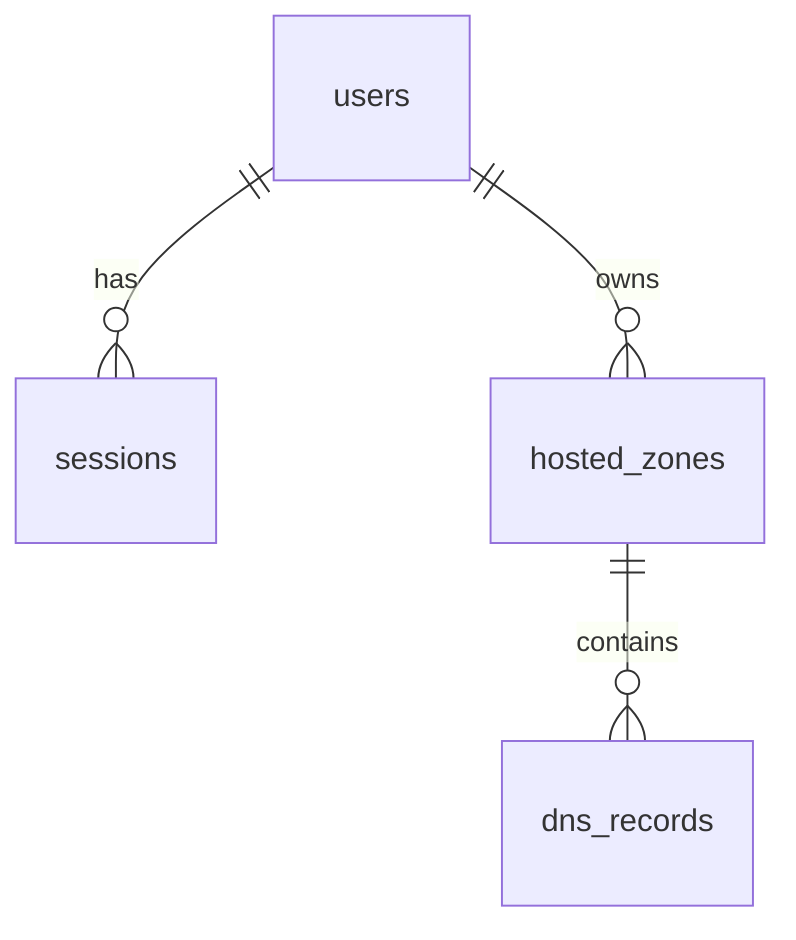

# Entity relationship diagram

## users

| Column | Type | Notes |
|---|---|---|
| id | integer | Primary key |
| username | string | Unique |
| password_hash | string | bcrypt hash |
| created_at | datetime | Creation timestamp |

## sessions

| Column | Type | Notes |
|---|---|---|
| id | integer | Primary key |
| user_id | integer | Foreign key to users.id |
| token_hash | string | Unique SHA-256 hash; raw token is cookie-only |
| created_at | datetime | Creation timestamp |
| expires_at | datetime | Session expiry |

## hosted_zones

| Column | Type | Notes |
|---|---|---|
| id | integer | Primary key |
| user_id | integer | Required foreign key to users.id |
| name | string | Lowercase, one trailing dot removed |
| comment | text | Nullable; only editable field |
| type | string | public or private |
| created_at | datetime | Creation timestamp |
| updated_at | datetime | Last update timestamp |
| constraint | unique | `(user_id, name)` |

## dns_records

| Column | Type | Notes |
|---|---|---|
| id | integer | Primary key |
| hosted_zone_id | integer | Foreign key with ON DELETE CASCADE |
| name | string | Normalized record name |
| type | string | A, AAAA, CNAME, TXT, MX, NS, PTR, SRV, CAA, or internal SOA |
| ttl | integer | Positive TTL |
| values | JSON | Structured type-specific values |
| routing_policy | string | Cosmetic routing-policy label |
| is_default | boolean | Protects auto-created NS/SOA records |
| created_at | datetime | Creation timestamp |
| updated_at | datetime | Last update timestamp |

Record counts are computed with `COUNT(dns_records.id)` at read time and are not stored.
SQLite foreign-key enforcement is enabled on every connection so deleting a zone cascades to its records.
